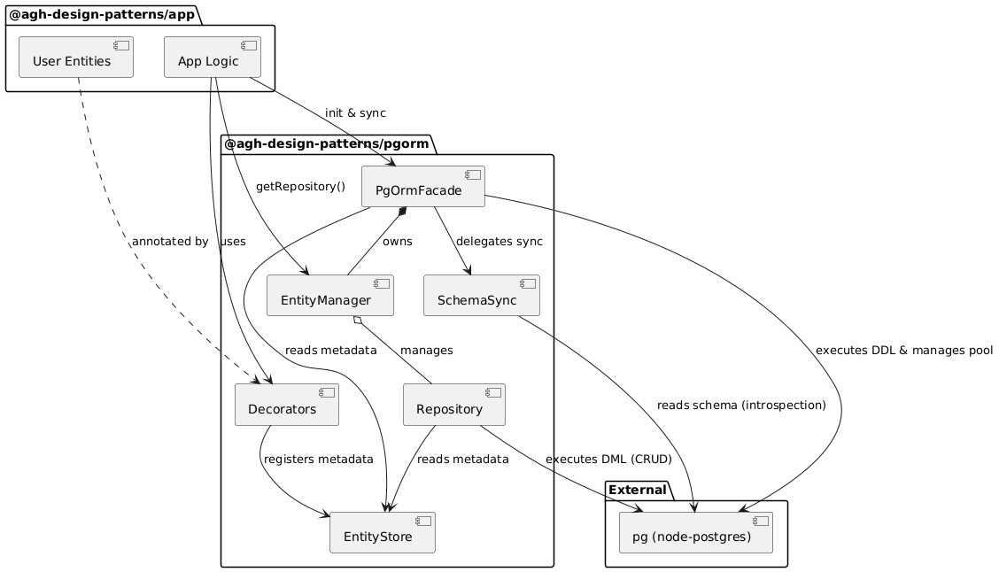
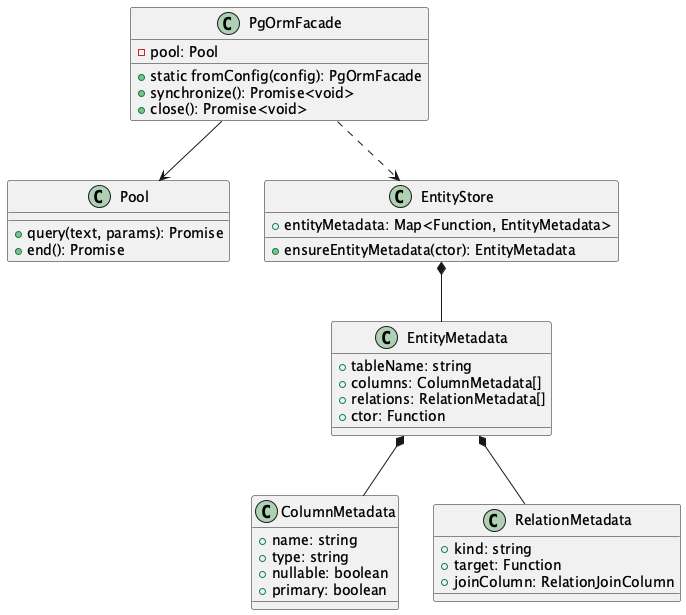

# Architecture

## Physical Architecture

The physical architecture for this project is considered trivial and not a primary focus. The system is designed to run in a simplified environment, typically on a single development machine where both the Node.js application and the PostgreSQL database (often containerized) reside. There is no complex distributed hardware setup or multi-node deployment strategy required for the scope of this project.

## Logical Architecture

The logical architecture describes the software components and their interactions.

### Layers

1.  **Application Layer** (`@agh-design-patterns/app`):
    -   Contains user-defined entities (e.g., `User`, `Product`).
    -   Configures and initializes the ORM.
    -   Uses the ORM Facade to synchronize schema and perform operations.

2.  **ORM Library Layer** (`@agh-design-patterns/pgorm`):
    -   **Facade**: The main entry point (`PgOrmFacade`). Orchestrates high-level operations.
    -   **Decorators**: `@Entity`, `@Column`, etc., used to define metadata.
    -   **Metadata Store**: A singleton registry (`entityMetadata`) holding the schema definitions.
    -   **Schema Synchronization**: Logic to compare metadata with the actual database schema (`diff`, `drop`, `create`).
    -   **Database Driver**: Uses `pg` library directly.

3.  **Infrastructure Layer**:
    -   **node-postgres (`pg`)**: The low-level driver handling the raw protocol communication with PostgreSQL.

## Class Diagram

The following diagram illustrates the core classes of the ORM and their relationships.

