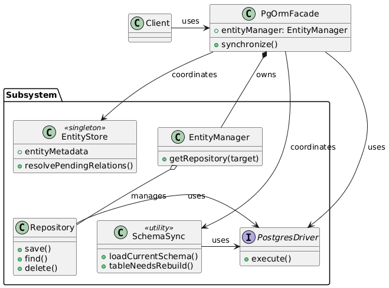

# Design Patterns

This project implements several standard software design patterns to ensure modularity, readability, and extensibility. Below is a list of the key patterns used.

## 1. Facade Pattern

**Usage**: `PgOrmFacade`

### Description
The **Facade** pattern provides a simplified interface to a complex subsystem. In our ORM, `PgOrmFacade` serves as the main entry point for the user. It hides the complexities of:
-   Initializing the database driver.
-   Collecting metadata.
-   Comparing the current database schema with the entity definitions.
-   Executing the necessary DDL statements to synchronize the schema.

### Why this pattern was chosen?
An ORM involves many moving parts: database connection pooling, metadata reflection, SQL generation, and schema diffing. Exposing all these internal components to the user would make the library difficult to use and error-prone. The Facade pattern allows us to provide a simple, high-level API (like `orm.synchronize()`) that encapsulates this complexity, making the library user-friendly and easy to integrate.

### Class Diagram


```typescript
// packages/pgorm/src/facade.ts
export class PgOrmFacade {
  // Hides the complexity of the driver and internal subsystems
  constructor(private readonly driver: PostgresDriver) {}

  // Simple method for the user that triggers complex logic internally
  async synchronize(): Promise<void> {
    // ... resolves relations, collects metadata, diffs schema, drops/creates tables ...
  }
}
```

## 2. Decorator Pattern

**Usage**: `@Entity`, `@Column`, `@OneToOne`, etc.

### Description
The **Decorator** pattern allows behavior or metadata to be added to individual objects, classes, or properties dynamically. We use TypeScript decorators to attach metadata (table names, column types, relationships) to class definitions without altering their actual code logic.

### Why this pattern was chosen?
We wanted the entity definitions to be plain TypeScript classes (POJOs) so they can be used easily in the rest of the application. Using inheritance (e.g., `class User extends BaseEntity`) would couple the domain model too tightly to the ORM. Decorators allow us to "decorate" these classes with database-specific metadata non-intrusively, keeping the domain logic clean and separated from the infrastructure configuration.

### Class Diagram


```typescript
// Usage
@Entity('users')
class User {
    @Column()
    name: string;
}
```

## 3. Adapter Pattern

**Usage**: `PostgresDriver`

### Description
The **Adapter** pattern allows incompatible interfaces to work together. `PostgresDriver` wraps the external `pg` (node-postgres) library and implements the `DatabaseDriver` interface. It adapts the `pg.Pool` interface to a simpler, domain-specific interface (`execute`, `query`, `end`) required by our ORM.

### Why this pattern was chosen?
The `pg` library has a specific API that might change or might be too low-level for our needs. By wrapping it in an Adapter (`PostgresDriver`) implementing `DatabaseDriver`, we decouple our ORM core logic from the specific database driver. This simplifies the internal code (which only relies on our `DatabaseDriver` interface) and makes it easier to switch to a different driver or mock the database connection for testing purposes in the future.

### Class Diagram


```typescript
// packages/pgorm/src/postgres-driver.ts
export class PostgresDriver {
  private readonly pool: Pool;

  constructor(config: PostgresDriverConfig) {
    this.pool = new Pool(config); // Adapts 'pg' Pool
  }

  async execute(sql: string, params: unknown[] = []): Promise<void> {
    await this.pool.query(sql, params);
  }
}
```

## 4. Singleton Pattern

**Usage**: `entityMetadata` Store

### Description
The **Singleton** pattern ensures a class has only one instance and provides a global point of access to it. While not implemented as a class with a `getInstance` method, the `entityMetadata` map in `entity-store.ts` acts as a module-level singleton. It ensures that all decorators across the application register their metadata in the same central registry.

### Why this pattern was chosen?
We need a single, central place to store all discovered entity metadata so that the `PgOrmFacade` can access it during synchronization. If we had multiple instances of the metadata store, decorators might register entities in one store while the facade reads from another, leading to incomplete schema generation. The module-level singleton guarantees a single source of truth for metadata.

## 5. Factory Method Pattern

**Usage**: `PgOrmFacade.fromConfig`

### Description
The **Factory Method** pattern provides an interface for creating objects. `PgOrmFacade.fromConfig` is a static factory method that encapsulates the logic of creating a `PgOrmFacade` instance along with its dependency (`PostgresDriver`).

### Why this pattern was chosen?
Constructing a `PgOrmFacade` requires a fully initialized `PostgresDriver`. Requiring the user to manually instantiate the driver and then pass it to the facade constructor exposes internal implementation details. The factory method simplifies the creation process: the user just provides the configuration, and the factory handles the instantiation and wiring of dependencies.
