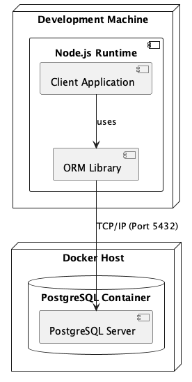

# Project Documentation: AGH Design Patterns

## 1. Introduction

This project implements a simplified Object-Relational Mapping (ORM) library for PostgreSQL, inspired by TypeORM. The goal is to provide a developer-friendly interface for interacting with a relational database using TypeScript classes and decorators.

Key features include:
-   **Decorator-based Entity Definition**: Defining database schemas using `@Entity` and `@Column` decorators on standard TypeScript classes.
-   **Schema Synchronization**: Automatically synchronizing the database schema with the entity definitions (creating tables, adding columns, defining foreign keys).
-   **Relationship Management**: Support for One-to-One, One-to-Many, Many-to-One, and Many-to-Many relationships.
-   **Type Safety**: Leveraging TypeScript's type system to ensure safe database interactions.

The project is structured as a monorepo containing the ORM library (`@agh-design-patterns/pgorm`) and a sample application (`@agh-design-patterns/app`) demonstrating its usage.

## 2. Architecture

### 2.1. Physical Architecture

The physical architecture for this project is considered trivial and not a primary focus. The system is designed to run in a simplified environment, typically on a single development machine where both the Node.js application and the PostgreSQL database (often containerized) reside. There is no complex distributed hardware setup or multi-node deployment strategy required for the scope of this project.

**Components:**

1.  **Development Machine / Host**:
    -   **Runtime**: Node.js (v22+).
    -   **Application**: The user application (`@agh-design-patterns/app`) running the ORM code.
    -   **Library**: The ORM library (`@agh-design-patterns/pgorm`) compiled to JavaScript.

2.  **Database Server**:
    -   **Container**: Docker Container running PostgreSQL 15.
    -   **Service**: PostgreSQL Database Server listening on port 5432.

**Connections:**

-   **TCP/IP**: The Node.js application connects to the PostgreSQL database via TCP/IP on `localhost:5432` (mapped from the Docker container).

### 2.2. Logical Architecture

The logical architecture describes the software components and their interactions.

**Layers:**

1.  **Application Layer** (`@agh-design-patterns/app`):
    -   Contains user-defined entities (e.g., `User`, `Product`).
    -   Configures and initializes the ORM.
    -   Uses the ORM Facade to synchronize schema and perform operations.

2.  **ORM Library Layer** (`@agh-design-patterns/pgorm`):
    -   **Facade**: The main entry point (`PgOrmFacade`). Orchestrates high-level operations.
    -   **Decorators**: `@Entity`, `@Column`, etc., used to define metadata.
    -   **Metadata Store**: A singleton registry (`entityMetadata`) holding the schema definitions.
    -   **Schema Synchronization**: Logic to compare metadata with the actual database schema (`diff`, `drop`, `create`).
    -   **Driver Adapter**: `PostgresDriver` wrapping the low-level `pg` library.

3.  **Infrastructure Layer**:
    -   **node-postgres (`pg`)**: The low-level driver handling the raw protocol communication with PostgreSQL.

## 3. Class Diagram

The following diagram illustrates the core classes of the ORM and their relationships.

## 4. Design Patterns

This project implements several standard software design patterns to ensure modularity, readability, and extensibility.

### 4.1. Facade Pattern

**Usage**: `PgOrmFacade`

**Description:**
The **Facade** pattern provides a simplified interface to a complex subsystem. In our ORM, `PgOrmFacade` serves as the main entry point for the user. It hides the complexities of:
-   Initializing the database driver.
-   Collecting metadata.
-   Comparing the current database schema with the entity definitions.
-   Executing the necessary DDL statements to synchronize the schema.

**Why this pattern was chosen?**
An ORM involves many moving parts: database connection pooling, metadata reflection, SQL generation, and schema diffing. Exposing all these internal components to the user would make the library difficult to use and error-prone. The Facade pattern allows us to provide a simple, high-level API (like `orm.synchronize()`) that encapsulates this complexity, making the library user-friendly and easy to integrate.

**Pros and Cons:**
-   **Pros**:
    -   **Simplifies Interface**: Provides a clean, easy-to-use API for the client.
    -   **Decoupling**: Decouples the client code from the complex subsystem components.
    -   **Readability**: Makes the application code more readable and maintainable.
-   **Cons**:
    -   **Limited Features**: May hide useful low-level features or configuration options available in the subsystem.
    -   **"God Object" Risk**: The facade can become bloated if it tries to do too much.

**Class Diagram:**

### 4.2. Decorator Pattern

**Usage**: `@Entity`, `@Column`, `@OneToOne`, etc.

**Description:**
The **Decorator** pattern allows behavior or metadata to be added to individual objects, classes, or properties dynamically. We use TypeScript decorators to attach metadata (table names, column types, relationships) to class definitions without altering their actual code logic.

**Why this pattern was chosen?**
We wanted the entity definitions to be plain TypeScript classes (POJOs) so they can be used easily in the rest of the application. Using inheritance (e.g., `class User extends BaseEntity`) would couple the domain model too tightly to the ORM. Decorators allow us to "decorate" these classes with database-specific metadata non-intrusively, keeping the domain logic clean and separated from the infrastructure configuration.

**Pros and Cons:**
-   **Pros**:
    -   **Flexibility**: Provides a flexible alternative to subclassing for extending functionality.
    -   **Separation of Concerns**: Keeps the entity classes clean and focused on domain logic.
    -   **Metadata**: Allows attaching metadata in a declarative way.
-   **Cons**:
    -   **Complexity**: Can make the code harder to understand and debug due to the "magic" happening behind the scenes.
    -   **Tooling Support**: Some tools or older environments might have limited support for decorators.

**Class Diagram:**

### 4.3. Adapter Pattern

**Usage**: `PostgresDriver`

**Description:**
The **Adapter** pattern allows incompatible interfaces to work together. `PostgresDriver` wraps the external `pg` (node-postgres) library and implements the `DatabaseDriver` interface. It adapts the `pg.Pool` interface to a simpler, domain-specific interface (`execute`, `query`, `end`) required by our ORM.

**Why this pattern was chosen?**
The `pg` library has a specific API that might change or might be too low-level for our needs. By wrapping it in an Adapter (`PostgresDriver`) implementing `DatabaseDriver`, we decouple our ORM core logic from the specific database driver. This simplifies the internal code (which only relies on our `DatabaseDriver` interface) and makes it easier to switch to a different driver or mock the database connection for testing purposes in the future.

**Pros and Cons:**
-   **Pros**:
    -   **Interoperability**: Allows incompatible interfaces to work together.
    -   **Reusability**: The existing `pg` library can be reused without modification.
    -   **Decoupling**: Decouples the client code from the specific implementation of the adaptee.
-   **Cons**:
    -   **Complexity**: Increases the overall complexity of the code by adding new classes.
    -   **Overhead**: Can introduce a slight runtime overhead due to the additional layer of indirection.

**Class Diagram:**

## 5. Inheritance Strategy

The ORM implements the **Concrete Table Inheritance** strategy (also known as Table Per Concrete Class).

### 5.1. Description

In this strategy:
-   Each concrete class in the inheritance hierarchy is mapped to its own independent database table.
-   The table contains columns for all properties defined in that specific class, as well as all inherited properties from parent classes.
-   There are no joins required to retrieve a single entity instance, as all data resides in one table.

### 5.2. Comparison with Other Strategies

| Strategy | Description | Pros | Cons |
| :--- | :--- | :--- | :--- |
| **Concrete Table Inheritance** (Ours) | One table per concrete entity class. | Simple queries (no joins), explicit schema per entity. | Potential data duplication for shared columns, no polymorphic relationships. |
| **Single Table Inheritance** | One table for the entire hierarchy with a discriminator column. | Fast reads, simple schema. | Sparse tables (many NULLs), potential integrity issues. |
| **Class Table Inheritance** (Joined) | Separate tables for parent and child, linked by FK. | Normalized data, clean schema. | Slow writes/reads due to JOINs, higher complexity. |

### 5.3. Why this Strategy?

We chose **Concrete Table Inheritance** for its simplicity and performance in read operations. Since our ORM focuses on simplicity and explicit entity definitions, avoiding complex joins (required by Class Table Inheritance) and sparse tables (common in Single Table Inheritance) was a priority. This strategy allows each entity to be self-contained, making the generated SQL straightforward and easy to debug.
